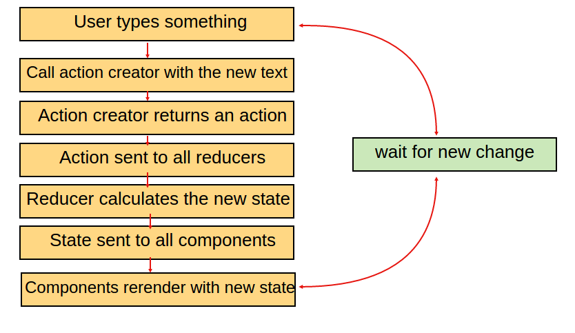
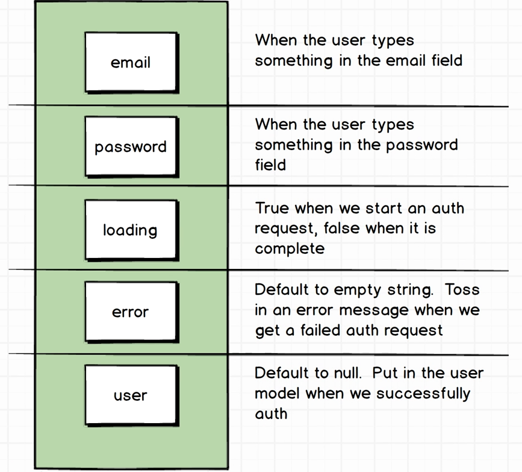

# AuthExample using React Native, Redux and Firebase
Double factor Authentication (the same form for sign in and sign up)

### Steps to set up Firebase project
1. Go to https://console.firebase.google.com/ and sign up for Firebase account.
2. Create a new project (call it whatever you like)
3. Go to ```Authentication``` tab located on the left side and set up our sign in method (in this example we are going to use an email and password)
4. Click on ```SIGN-IN METHOD```

  - pick ```Email/Password``` and slide the enable button to be on and click SAVE
  - click on the ```WEB SETUP``` on the right corner of the screen
  - copy the ```config``` object and intilizer (everything inside the script tag excluding script tag -  we don't need it )
  - replace your config with mine in ```src/index.js``` (you should keep these keys secret and never publish to the public, for this example I omit that step because this app is only be used for learning and demonstration purpose)

5. Create test user in Firebase by clcking on ```Authentication``` on the left and then ```ADD USER```

### Login redux breakdown

<br />




### Application state

```js
{
  email: ''
  password: ''
  loading: BOOLEAN
  error: ''
  user: null
}
```

**Breakdown**
<br/>




### Reference

- all firebase methods used to sign in or sign up users can be found here - https://firebase.google.com/docs/auth/web/password-auth
